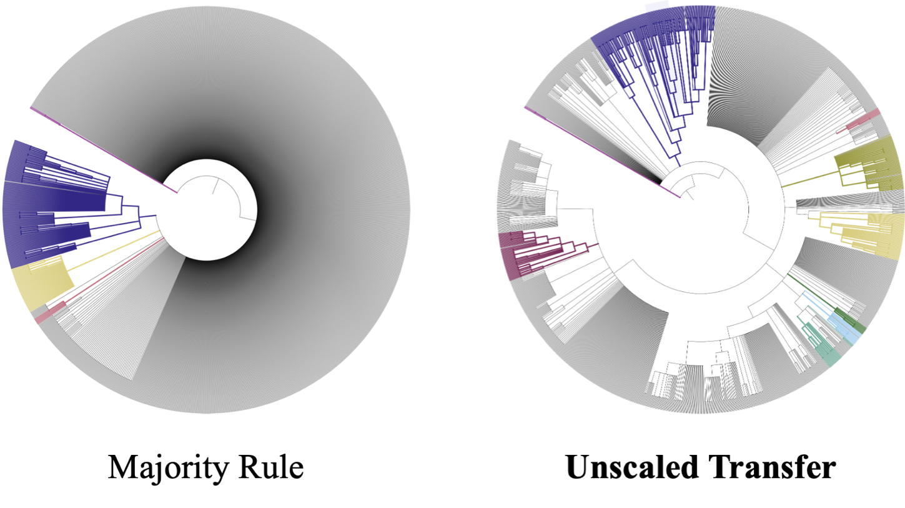
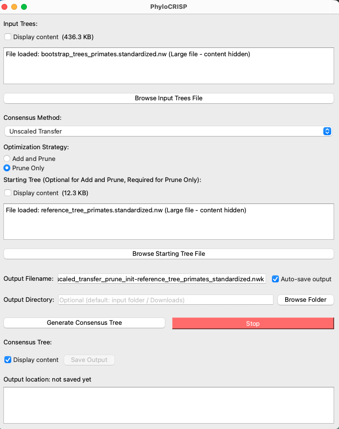
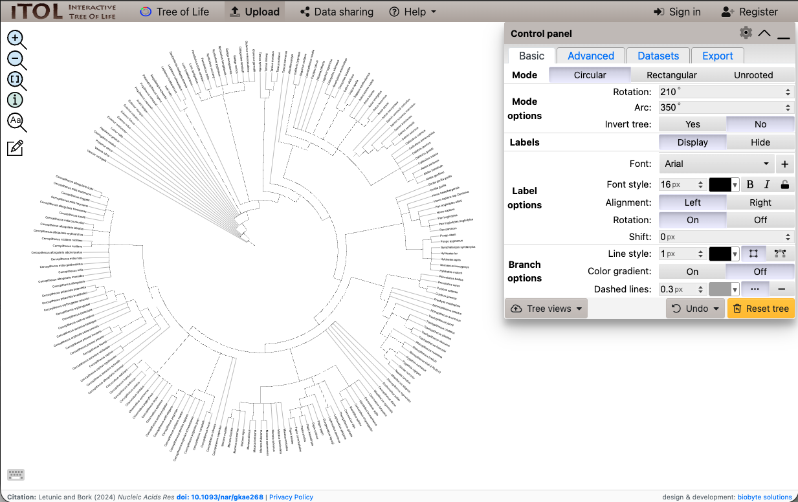

#  PhyloCRISP: Phylogenetic Consensus Resolution via Improved Split Proximity

<p align="center">
  
</p>
<p align="center"><em>Consensus trees on the mammals bootstrap dataset (Figure 5).</em></p>

PhyloCRISP is a software package for constructing more resolved, meaningful consensus trees from a set of phylogenetic trees than the conventional majority-rule trees.
This repository provides the official software implementation for:

Yuki Takazawa, Atsushi Takeda, Momoko Hayamizu, and Olivier Gascuel. **Outperforming the Majority-Rule Consensus Tree Using Fine-Grained Dissimilarity Measures**, _submitted_, bioRxiv preprint available at https://doi.org/10.64898/2026.03.16.712085.

> **Abstract.** Phylogenetic analyses often require the summarization of multiple trees, e.g., in Bayesian analyses to obtain the centroid of the posterior distribution of trees, or to determine the consensus of a set of bootstrap trees. The majority-rule consensus tree is the most commonly used. It is easy to compute and minimizes the sum of Robinson-Foulds (RF) distances to the input trees. In mathematical terms, the majority-rule consensus tree is the median of the input trees with respect to the RF distance. However, due to the coarse nature of RF distance, which only considers whether two branches induce exactly the same bipartition of the taxa or not, highly unresolved trees can be produced when the phylogenetic signal is low. To overcome this limitation, we propose using median trees with respect to finer-grained dissimilarity measures between trees. These measures include a quartet distance between tree topologies, and transfer distances, which quantify the similarity between bipartitions, in contrast to the 0/1 view of RF. We describe fast heuristic consensus algorithms for transfer-based tree dissimilarities, capable of efficiently processing trees with thousands of taxa. Through evaluations on simulated datasets in both Bayesian and bootstrapping maximum-likelihood frameworks, our results show that our methods improve consensus tree resolution in scenarios with low to moderate phylogenetic signal, while providing better or comparable dissimilarities to the true phylogeny. Applying our methods to Mammal phylogeny and a large HIV dataset of over nine thousand taxa confirms the improvement with real data. These results demonstrate the usefulness of our new consensus tree methods for analyzing the large datasets that are available today. Our software,
> 33 PhyloCRISP, is available from https://github.com/yukiregista/PhyloCRISP.

The software supports both a graphical user interface (GUI) and a command-line interface (CLI), as demonstrated in the following tutorial.

<!-- While the entire datasets analyzed in the paper is available at DRYAD, some of the data are also found in `example_data` for the tutorial purpose.  -->

Some tutorial input data are available in `example_data/`.
For manuscript datasets and external source links, see [`data/`](data/) and [`data/README.md`](data/README.md).

## Install (GUI)

You can download and install the GUI version of PhyloCRISP for Windows, macOS, and Linux:

- [Windows Installer (x64)](https://github.com/yukiregista/PhyloCRISP/releases/latest/download/PhyloCRISP-Setup-0.0.2-win-x64.exe)
- [Windows Portable (zip)](https://github.com/yukiregista/PhyloCRISP/releases/latest/download/PhyloCRISP-0.0.2-win-x64-portable.zip)
- [Mac (Apple Silicon)](https://github.com/yukiregista/PhyloCRISP/releases/latest/download/PhyloCRISP-0.0.2-macos.dmg)
- [Linux (x64, AppImage)](https://github.com/yukiregista/PhyloCRISP/releases/latest/download/PhyloCRISP-0.0.2-linux-x64.AppImage)
- [Linux (x64, tar.gz)](https://github.com/yukiregista/PhyloCRISP/releases/latest/download/PhyloCRISP-0.0.2-linux-x64.tar.gz)

The Windows portable zip is provided as a fallback option if the installer is blocked by antivirus/SmartScreen on some environments.

## Tutorial (GUI)

This tutorial walks through the GUI workflow for generating consensus trees using an example primate clade dataset (a subset of the mammals dataset used in the paper).

### Step 1: Prepare Input Files

You will need the following two files from this tutorial dataset.
They are included in this repository under `example_data/primates/`:

- [`example_data/primates/bootstrap_trees_primates.standardized.nw`](example_data/primates/bootstrap_trees_primates.standardized.nw) — the set of 100 bootstrap trees (input trees, ~436 KB)
- [`example_data/primates/reference_tree_primates.standardized.nw`](example_data/primates/reference_tree_primates.standardized.nw) — the reference tree used as the starting tree (~12 KB)

### Step 2: Launch the Application

Run the GUI application.

On macOS and Windows, you may see security warnings when running software from outside the official app store or package manager. On macOS, allow the app to run via **System Settings → Privacy & Security** ([Apple support](https://support.apple.com/guide/mac-help/open-a-mac-app-from-an-unknown-developer-mh40616/mac)). On Windows, click **More info → Run anyway** in the SmartScreen warning ([Microsoft SmartScreen overview](https://learn.microsoft.com/en-us/windows/security/operating-system-security/virus-and-threat-protection/microsoft-defender-smartscreen)).

On Linux, if the AppImage does not open, right-click the file, go to **Properties → Permissions**, and enable **Allow executing file as program**.

### Step 3: Configure the Settings

In the GUI, configure the following options as shown in the screenshot below:

1. **Input Trees**: Click _Browse Input Trees File_ and select `bootstrap_trees_primates.standardized.nw`.
2. **Consensus Method**: Here we select **Unscaled Transfer** from the dropdown menu to measure the dissimilarity between trees using this type of distance.
3. **Optimization Strategy**: Here we select **Prune Only** to compute a median tree, which requires specifying an initial tree in the next step.
4. **Starting Tree**: Click _Browse Starting Tree File_ and select `reference_tree_primates.standardized.nw` as an initial tree. _(This option is required when using Prune Only.)_
5. **Output Filename**: Set a name of your choice. We also recommend ticking the checkbox **Auto-save output**.
6. **Output Directory**: Choose your desired output directory.



### Step 4: Run and Save

Click **Generate Consensus Tree** to start the computation. For this example dataset, computation typically finishes within a minute (depending on your machine). Once complete, the consensus tree is displayed in the _Consensus Tree_ panel at the bottom, and the Newick file (`.nwk`), together with transfer support values (`.nwk.tsupp`) and frequency values (`.nwk.fsupp`), is saved to your specified directory. If you did not enable **Auto-save output**, you can still save the result by clicking **Save Output**.

### Step 5: Visualize the Consensus Tree

You can visualize the consensus tree using your preferred phylogenetic tool. For example, you can upload the Newick file to [ITOL v7](https://itol.embl.de/).



### Step 6: Compare with the Majority-Rule Consensus Tree

You can compare this consensus tree with a majority-rule consensus tree from the same example dataset. To generate the majority-rule tree, select **Majority Rule** from the dropdown menu for Consensus Methods in Step 3, then visualize the output Newick file in your preferred viewer (e.g., [ITOL v7](https://itol.embl.de/)).

## Install (CLI)

You can install and use the CLI version of PhyloCRISP as follows.
CLI support via `pip install` is currently Linux/macOS only.

1. Clone the repository:

```sh
git clone git@github.com:yukiregista/PhyloCRISP.git
```

2. Install the package:

```sh
pip install .
```

3. Build `booster` (for support-value outputs and transfer prune-only workflows):

```sh
cd src/booster/src
make
cd ../../..
```

On macOS with Apple clang, install OpenMP first if needed:

```sh
brew install libomp
```

4. Ensure `tqdist` is available when using `--method quartet`:

- Install `tqdist` by following the official instructions: https://www.birc.au.dk/~cstorm/software/tqdist/
- Ensure `quartet_dist` and `pairs_quartet_dist` are available on `PATH`

5. Confirm installation:

```sh
phylocrisp-cli --help
```

## Usage (CLI)

```sh
phylocrisp-cli \
  --input-trees <path/to/input_trees.nw> \
  --method <scaled_transfer|unscaled_transfer|quartet|mr> \
  [--strategy <add_and_prune|prune>] \
  [--starting-tree <path/to/starting_tree.nw>] \
  [--output-filename <name_or_path.nwk>] \
  [--output-dir <output_directory>]
```

File format information:

- `--input-trees`: Newick file containing input trees.
- `--starting-tree`: Newick file containing one starting tree.
- Main output is written as Newick (`*.nwk`).
- When `booster` is available, additional outputs are `*.fsupp` (frequency support) and `*.tsupp` (transfer support).

Argument notes:

- `--input-trees` and `--method` are required.
- `--strategy` defaults to `add_and_prune`.
- `--method quartet` supports `--strategy prune` only.
- `--starting-tree` is required for prune workflows.
